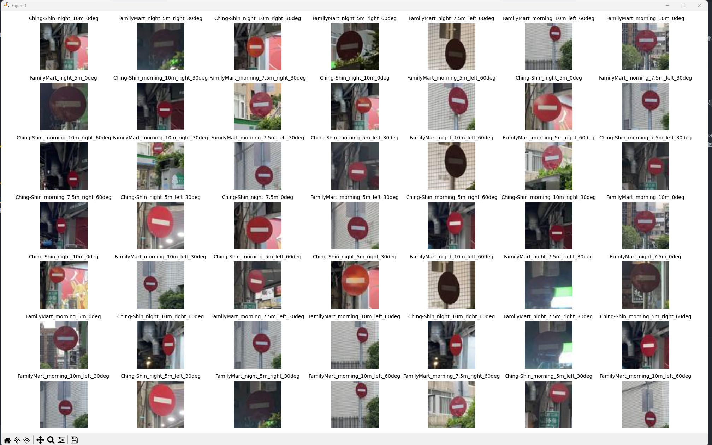
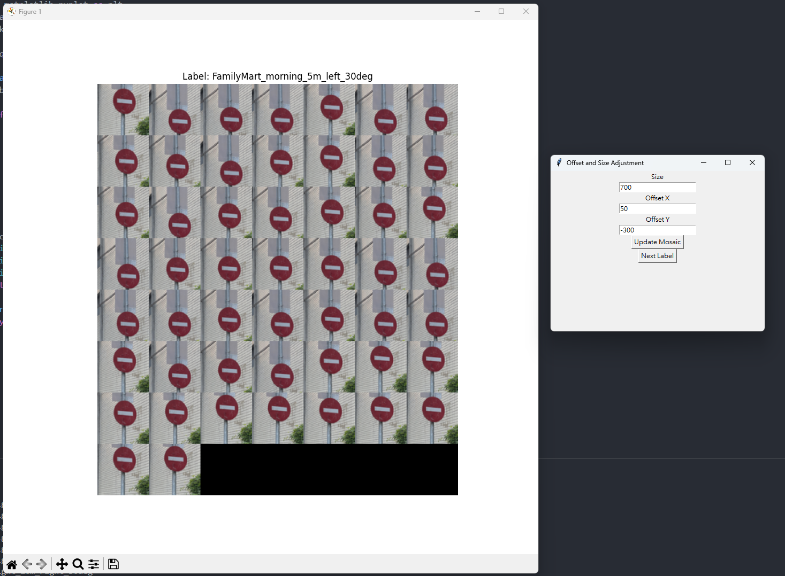

### 照片資料夾結構：
* 適用於 `./original` 和 `./processed`
* 地點 > 時間 > 距離 [> 左右] > 角度(0度就沒有左右那層) > 照片.JPG
    * e.g.: `./FamilyMart/morning/10m/right/60deg/1.jpg`
    * e.g.: `./FamilyMart/morning/7.5m/0deg/30.jpg`
* 目前每個屬性的分類：
    * 地點：`FamilyMart` 和 `Ching-Shin`
    * 時間：`morning` 和 `night`
    * 距離：`5m`,  `7.5m` 和 `10m`
    * 左右：`left` 和 `right`
    * 角度：`0deg`(不會有左右那層),  `30deg` 和 `60deg`
* `Ching-Shin` 在 >= `7.5m` 時不會有 `left` 的 `60deg`，因為那個角度會要在建築裡面才拍的到

### label方式
* 會遞迴讀取資料夾中全部的照片，把資料夾名稱以 `_` 組合起來當作 label
    * e.g.: `FamilyMart_morning_10m_right_60deg`

### load data：
* 寫在 `load_data.py` 中
* 讀取 `processed` 資料夾中全部的 label 和 images
* 會存成一個 dict ，label 為 key，images list為value
    * e.g.: data = {'FamilyMart_morning_10m_right_60deg': [\<image1>, \<image2>, ...]}
* 執行 `load_data.py` 後會得到處理好的 dict，也會隨機取樣 50 個 images 輸出出來看一下，隨機取樣的 code 上下有用 `########` 框起來，不需要時可以刪掉
    * e.g.:

### process data
* 寫在 `process_data.py` 中
* 原照片存在 `./original `中，是用 iphone 12 拍的，因照片太大所以沒傳到 github 上
* 負責裁切照片和壓縮成 64*64，而裁切的大小和位置定義在 `crop_dict` 中
* 讀取 `original` 資料夾中全部的 label 和 images
    * 會輸出讀取到的全部 labels
* 有兩個功能：
    1. 遍歷全部label。一次把該 label 全部 process 後的照片畫在同一張圖上，以確認此次裁切大小與位置是否合適。不合適的話可以動態在 GUI 更新數值並重畫，直到合適後切換下一個 label
        * e.g.: 
        * 會把最後該 label 的裁切大小和位置 print 在 terminal，要自己複製去手動更新 `crop_dict`，並不會自動更新 `crop_dict`
    2. 把全部 process 過後的照片根據他的 label 存在 `process` 資料夾中，資料夾結構會跟 `./original ` 相同。照片依序命名為 `1.jpg`、`2.jpg`...
        * 跑完功能 1 後，功能 2 仍然會是原本定義的 `crop_dict`，要自己手動更新才行